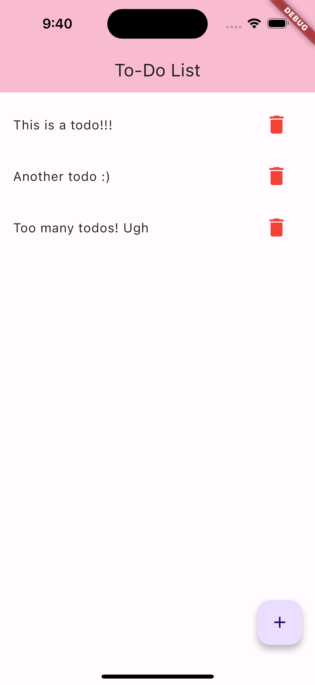

# Flutter + Dart + Supabase Template
Created by Sidharth Lakshmanan, Curated by the Tech Team

## Background
Flutter is a mobile application framework compatible for both IOS and Android that allows you to build applications for phones, embedded devices, and the web. Note that because the same code can be compiled for all use cases, you only need to write the code once!

Flutter is an open source framework by Google and is used by so many companies:

You can learn more about Flutter here: https://flutter.dev/

Supabase is an open source Google Firebase alternative that comes with a PostgresSQL database, Authentication, instant APIs, Edge Functions, Realtime subscriptions, Storage, and Vector embeddings.

You can learn more about Supabase here: https://supabase.com/

## The App
Once you set everything up, you will have the following To-do application that can run on both IOS and Android and allows you to add and delete To-Do's!

## Getting Started
First, install flutter for your computer. Also, highly recommend installing an emulator (in the steps for installing flutter):

https://docs.flutter.dev/get-started/install

Once you are done with that, start following the steps listed 
in the README's in the `todo_frontend` and `todo_server` to set up and run the front-end and backend respectively.

Have Fun!

*PS: This template is far from perfect, so if you find anything wrong, have any questions, or run into any steps you do not understand, reach out to the tech team!*
