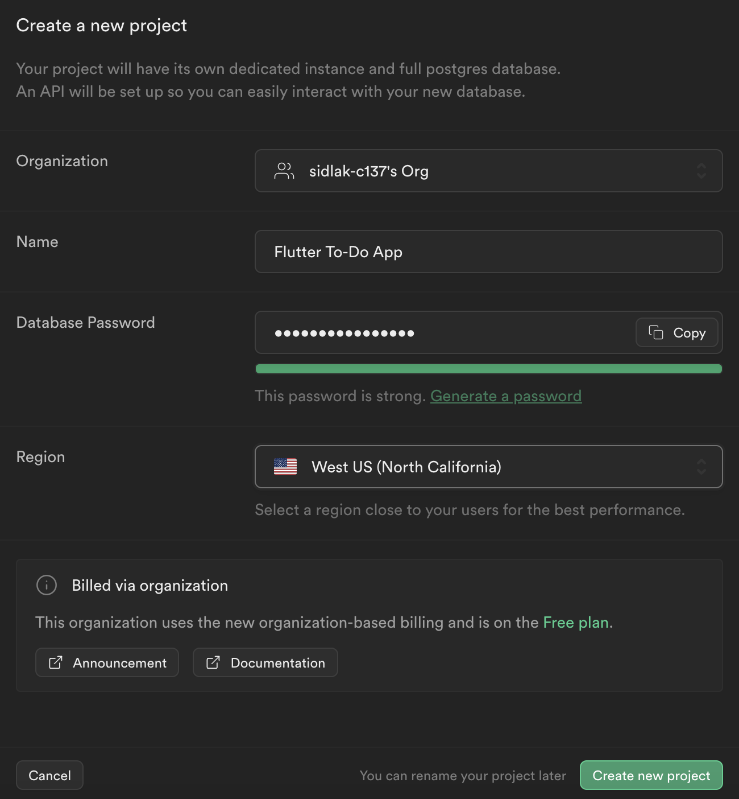
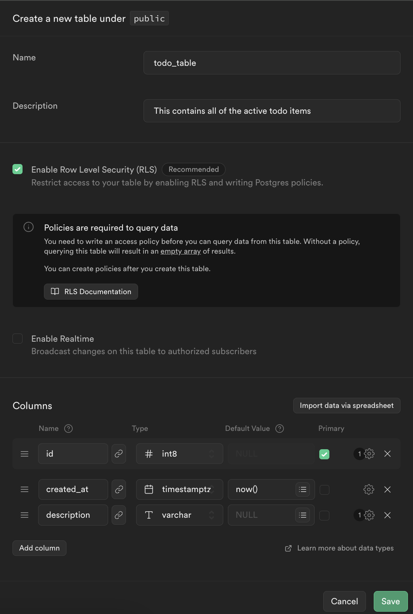
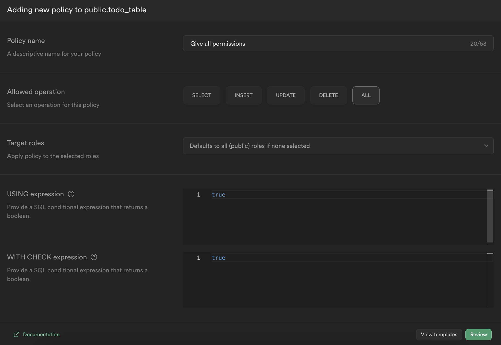
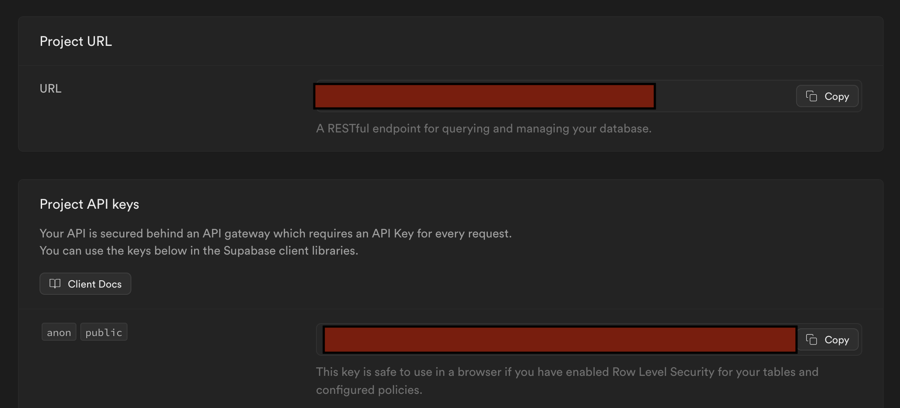

# Dart + SQL Backend w/ Supabase
We are using dart for the server purely because dart is already
installed when you set up flutter. SQL however is the most popular
database qeury language, so that is why we are using it here. Feel
free to take the ideas presented here and set up a different database or server!

# Background
To learn more about how to use Dart to interact with Supabase, read the Supabase for Flutter [docs](https://supabase.com/docs/reference/dart/introduction).

To learn more about the dart language, visit the [Dart Docs](https://dart.dev/guides)

Dart and Supabase also have large communities, so Google/Stack Overflow is your best friend!

# Supabase Setup

First create an account and make a new project in [supabase](https://supabase.com/). Note that creating a project can take a couple of minutes to initialize:



Next, create a new SQL table in your project using the "Table Editor". Make sure the table name and the table columns match up exactly, or the table might not work!



Finally, set up RLS policies for that table. Make sure these fields match as well!!! We are going to give anyone with the API Key and URL access to read and write to this table. Because we are doing this, make sure to keep your keys secret! 



# Dart Server Setup

First, install the dependencies using 

```bash
dart pub get
```

Next, you can run the server using the command:

```bash
dart run --define=SUPABASE_URL={} --define=SUPABASE_KEY={}
```
Where the "`{}`" after the SUPABASE_URL should be replaced with your projects URL and the "`{}`" after the SUPABASE_KEY should be replaced with your "anon public key":



DO NOT POST THE API KEY IN YOUR REPO OR ANYWHERE PUBLIC!!!

Once you have run the server, you should see something like this:

```bash
Building package executable... 
Built todo_server:todo_server.
Serving at http://localhost:8080
```
This means that your server is running and accepting connections at http://localhost:8080. Try going here in your browser! You should see some "Welcome" text.

You should be good to start coding! Make sure to read all of the comments in `bin/todo_server` and `lib/*` :) Happy Coding!


